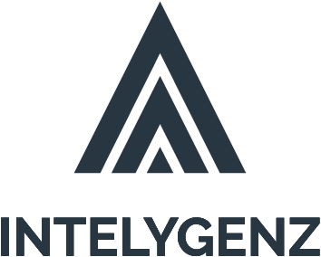

# The real SRE challenge



Hey! You're here because you want to show your worth as a Site Reailibily Engineer (a.k.a SRE). You know what? I'm really happy you're here. If you want more information about what is a SRE, we recommend read the [books](https://sre.google/books/) published by Google to increase your knowledge.

Let's go!

# The challenge starts here

You have to fork this repository to complete the following challenges in your own `github` account. **Feel free to solve the challenge you want**. If you have any doubt, don't hesitate to open an issue to ask any question about any challenge.

Exists **6 basic challenges** and **3 extras challenge**. So, the basic we recommend to finish them and the extra only if you want demostrate more.

* Every challenge must have the **SOLUTION.md** in their directory.
* The content of SOLUTION.md is **how-to obtain the result**, **executed commands** and **short explanation** (if necessary).

And... this is all. The first step is clone the repository and read quietly.

## Challenge 1. Basic search

*NOTE: Go `challenge-1` directory.*

We've found a `sample.log` file with 3360 lines but we need some info. Can you help us?

* Count all lines with `500` HTTP code.
* Count all `GET` requests from `yoko` to `/rrhh` location and was OK (`200`).
* How many requests go to `/`?
* Count all lines without `5XX` HTTP code.
* Replace all `503` HTTP code by `500`, how many requests have `500` HTTP code?

## Challenge 2. Overview system

*NOTE: Create `challenge-2` directory.*

We would like get some info. about the server. Can you help us? Someone told us about [`sysstat`](http://sebastien.godard.pagesperso-orange.fr/) package.

* Check the distribution.
* Check CPU usage.
* Check RAM usage. Can you explain the difference of `free`, `used`, `shared` and `available` stats?
* List block devices and file system disk.
* Obtain TCP and UDP listen ports.
* Get only PID top 10 process with more CPU usage.
* List all pid which open/used `/dev/null`.

## Challenge 3. Scripting

*NOTE: Create `challenge-3` directory.*

We would like use the `challenge-2` commands with a simple menu (develop with `bash` script). In my mind the `-h` (help) print this:

```bash
Usage: myscript [options..]
Myscript description

Myscript options:
  -d, --disk       check disk stats
  -c, --cpu        check cpu stats
  -p, --ports      check listen ports
  -r, --ram        check ram stats
  -o, --overview   top 10 process with more CPU usage.
```

## Challenge 4. Is running?

*NOTE: Go `challenge-4` directory.*

We've the `server.py` code and we want containerized (with `docker`) this HTTP server. Can you give us the `Dockerfile`? Ah! Can you check everything is running? Our technical team told us we need make a request with `Challenge: intelygenz.com` header. Can you give us the result that server print?

## Challenge 5. What's wrong?

*NOTE: Go `challenge-5` directory.*

Oh, no! I don't know what happen on this binary! Can you help me? When I executed the binary told me always `Ooooh, what's wrong? :(`. How to fix it? We expected `Congrats! :)` message.

## Challenge 6. Build with Ansible

*NOTE: Go `challenge-6` directory.*

*NOTE 2: We recommend use a Virtual Machine with Debian (or you favorite flavour).*

You find a playbook but is incomplete. Can you develop Ansible tasks to deploy the `challenge-4`?

* Add the server on the inventory.
* Install `docker`.
* `build` the image from `Dockerfile` (challenge-4).
* Deploy the image on the server.
* Check if HTTP server is running and response properly.
* Save the output of the `ansible-playbook` execution in `ansible.log` file and upload.
* Group tasks with `tags`.

We've some modules to solve it:

* [build Docker image](https://docs.ansible.com/ansible/latest/collections/community/docker/docker_image_module.html)
* [deploy container](https://docs.ansible.com/ansible/latest/collections/community/docker/docker_container_module.html)
* [check server via HTTP](https://docs.ansible.com/ansible/latest/collections/ansible/builtin/uri_module.html)

# Extra Challenges

## Extra Challenge 1. Build with Terraform

*NOTE: Create `challenge-extra-1` directory.*

* Use [kreuzwerker/docker](https://registry.terraform.io/providers/kreuzwerker/docker/latest/docs) and [hashicorp/http](https://registry.terraform.io/providers/hashicorp/http/latest/docs/data-sources/http) providers to replicate `challenge-6` with Terraform.
* Upload all files when you finished the task.

## Extra Challenge 2. Kubernetes

*NOTE: Go `challenge-extra-2` directory.*

Prepare environment:

* Install [microk8s](https://microk8s.io/) or [minikube](https://minikube.sigs.k8s.io/docs/start/).
* Execute `kubectl apply -f manifests/`.

Get info.:

* Get all namespaces.
* Get all pods from all namespaces.
* Get all resources from all namespaces.
* Get all services from namespace `intelygenz`.
* Get all deployments from `tools`.
* Get image from `nginx` deployment on `intelygenz` namespace.
* Create a `port-forward` to access `nginx` pod on `intelygenz` namespace.

## Extra Challenge 3. Test Ansible

*NOTE: Create `challenge-extra-3` directory.*

* Use [molecule](https://molecule.readthedocs.io/en/latest/) to test `challenge-6` with your prefered (and compatible) [provider](https://molecule.readthedocs.io/en/stable-1.9/#provider) and [driver](https://molecule.readthedocs.io/en/stable-1.9/#driver).
* Upload all files when you finished the task.